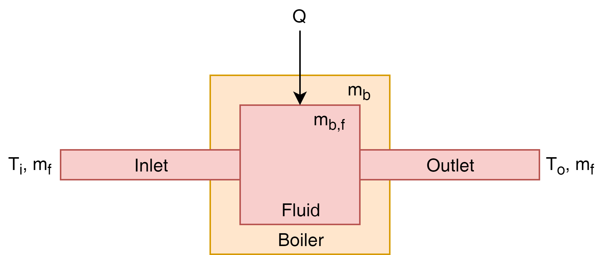
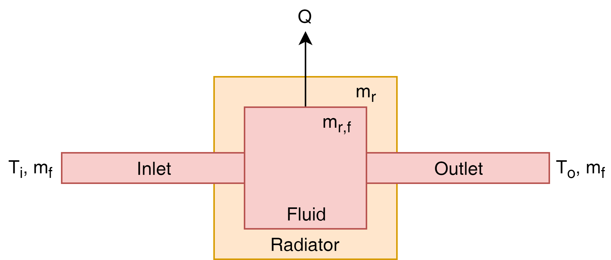
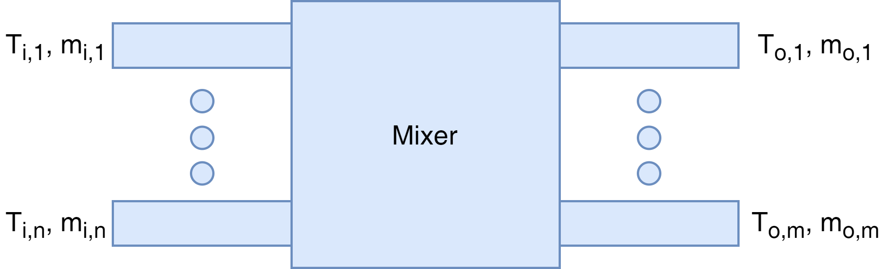

# Building Energy Model (MATLAB) #
It is a small software which is developed by MATLAB for modeling the energy system of a building or a HVAC system.

## Method of Solution ##
In this code, the temperatures are considered variables of the problem, which are solved implicitly by solving a system of linear equations based on energy equations of each element.

## Elements Classes ##

### Boiler ###
The boiler contains an inlet fluid pipe, an outlet fluid pipe, a fluid tank which is heated up, and the rest. The class of boiler receives input values including the id of the inlet, the id of outlet, the solver, the specific heat capacity of the rest, the mass of the rest, specific heat capacity of the fluid, mass of the fluid, the boiler power, the mass flow rate, and the status. The inlet and outlet should be outlet and inlet of pipes which are connected to the boiler respectively. The solver is the class of the solver that is used. Next, there are specific heat capacity and mass of the boiler except containing fluid. Then, there are those of the fluid. The next argument is the power of the boiler. The mass flow rate also should be given as an input value. The status works as a switch in the boiler which can be controlled by the smart controller in the next stages of the project.

#### Equations ####



#### Variables ####

| Symbol | Description | Unit |
| --- | --- | --- |
| *m* | Mass | *kg* |
| *C* | Specific Heat Capacity | *J/(K.kg)* |
| *T* | Temperature | *K* |
| *E.* | Energy Rate | *W* |

| Subscript | Description |
| --- | --- |
| *b* | Boiler |
| *f* | fluid |
| *b,f* | Fluid inside Boiler |
| *b,i* | Boiler Inlet |
| *b,o* | Boiler Outlet |

#### Code ####
##### Construction ######
```Matlab
boiler = Boiler(id_inlet, id_outlet, solver, specific_heat_capacity, mass, specific_heat_capacity_fluid, mass_fluid, power, mass_flow_rate, status);
```

| Input | Description | Type | Unit |
| --- | --- | --- | --- |
| `id_inlet` | Boiler Inlet ID | `integer` | - |
| `id_outlet` | Boiler Outlet ID | `integer` | - |
| `solver` | Class of the Solver | `solver` | - |
| `specific_heat_capacity` | Specific Heat Capacity of the Boiler (without fluid) | `double` | *J/(K.kg)* |
| `mass` | Mass of the Boiler (without fluid) | `double` | *kg* |
| `specific_heat_capacity_fluid` | Specific Heat Capacity of the Fluid | `double` | *J/(K.kg)* |
| `mass_fluid` | Mass of Fluid inside the Boiler | `double` | *kg* |
| `power` | Power of the Boiler | `double` | *W* |
| `mass_flow_rate` | Mass Flow Rate of the Boiler | `double` | *kg/s* |
| `status` | Status of the Boiler (ON/OFF) | `boolean` | - |

##### Create Matrix #####
```Matlab
create(solver)
```

| Input | Description | Type | Unit |
| --- | --- | --- | --- |
| `solver` | Class of the Solver | `solver` | - |

---

### Pipe ###
Another element in the model is the pipe. The input values of the pipe class are the id of inlet, the id of outlet, the id of zone, the solver, specific heat capacity of the pipe wall, density of the pipe wall, specific heat capacity of the fluid, density of the fluid, mass flow rate of the fluid, inner heat transfer coefficient, outer heat transfer coefficient, thermal conductivity of the tube wall, inner radius of the pipe, outer radius of the pipe, and length of the pipe. The inlet and outlet of the pipe are the elements which are connected to the pipe. The zone which is in contact with the outer side of the pipe is also the argument of the class.

#### Equations ####


#### Variables ####

| Symbol | Description | Unit |
| --- | --- | --- |
| *h* | Heat Transfer Coefficient | *W/(m<sup>2</sup>K)* |
| *r* | Radius | *m* |
| *k* | Thermal Conductivity | *W.m<sup>-1</sup>.K<sup>-1</sup>* |
| *L* | Length | *m* |
| *U* | equivalent heat transfer coefficient | *W/(m<sup>2</sup>K)* |
| *Nu* | Nusselt Number | - |
| *Re* | Reynolds Number | - |
| *Pr* | Prandtl Number | - |
| *Ra* | Rayleigh Number | - |
| *g* | Gravitational Acceleration | m/s<sup>2</sup> |
| *&‌beta;* | Coefficient of Volume Expansion | 1/K |
| *&‌nu;* | Kinematic Viscosity | m<sup>2</sup>/s |
| *&‌mu;* | Dynamic Viscosity | kg·m<sub>−1<sub>·s<sub>−1<sub> |


| Subscript | Description |
| --- | --- |
| *t* | Pipe |
| *t,f* | Fluid inside Pipe |
| *t,i* | Pipe Inlet |
| *t,o* | Pipe Outlet |
| *t,in* | Pipe Inner Side |
| *t,out* | Pipe Outer Side |

#### Code ####
##### Construction ######
```Matlab
pipe = Pipe(id_inlet, id_outlet, id_zone, solver, specific_heat_capacity, density, specific_heat_capacity_fluid, density_fluid, mass_flow_rate,thermal_conductivity,thermal_conductivity_fluid,radius_inner,radius_outer,length,dynamic_viscosity_fluid,dynamic_viscosity_air,density_air,specific_heat_capacity_air,thermal_conductivity_air);
```

| Input | Description | Type | Unit |
| --- | --- | --- | --- |
| `id_inlet` | Pipe Inlet ID | `integer` | - |
| `id_outlet` | Pipe Outlet ID | `integer` | - |
| `id_zone` | Zone ID | `integer` | - |
| `solver` | Class of the Solver | `solver` | - |
| `specific_heat_capacity` | Specific Heat Capacity of the Pipe (without fluid) | `double` | *J/(K.kg)* |
| `density` | Density of the Pipe (without fluid) | `double` | *kg/m<sup>3</sup>* |
| `specific_heat_capacity_fluid` | Specific Heat Capacity of the Fluid | `double` | *J/(K.kg)* |
| `density_fluid` | Density of Fluid inside the Pipe | `double` | *kg/m<sup>3</sup>* |
| `mass_flow_rate` | Mass Flow Rate of the Pipe | `double` | *kg/s* |
| `thermal_conductivity` | Thermal Conductivity of the Pipe | `double` | *W.m<sup>-1</sup>.K<sup>-1</sup>* |
| `thermal_conductivity_fluid` | Thermal Conductivity of the Fluid | `double` | *W.m<sup>-1</sup>.K<sup>-1</sup>* |
| `radius_inner` | Inner Radius of the Pipe | `double` | *m* |
| `radius_outer` | Outer Radius of the Pipe | `double` | *m* |
| `length` | Length of the Pipe | `double` | *m* |
| `dynamic_viscosity_fluid` | Dynamic Viscosity of the Fluid | `double` | *N·s/m<sup>2</sup>* |
| `dynamic_viscosity_air` | Dynamic Viscosity of the Air | `double` | *N·s/m<sup>2</sup>* |
| `density_air` | Density of the Air | `double` | *kg/m<sup>3</sup>* |
| `specific_heat_capacity_air` | Specific Heat Capacity of the Air | `double` | *J/(K.kg)* |
| `thermal_conductivity_air` | Thermal Conductivity of the Air | `double` | *W.m<sup>-1</sup>.K<sup>-1</sup>* |

##### Create Matrix #####
```Matlab
create(solver)
```

| Input | Description | Type | Unit |
| --- | --- | --- | --- |
| `solver` | Class of the Solver | `solver` | - |

---

### Radiator ###
The input values of the radiator class are the id of inlet, the id of outlet, the id of zone, the solver, specific heat capacity of the radiator except containing fluid, mass of the radiator except containing fluid, specific heat capacity of the fluid, mass of fluid, mass flow rate of the fluid, heat transfer coefficient of the radiator to the zone, the surface of the radiator which is in contact to the air of the zone.

#### Equations ####



#### Variables ####

| Subscript | Description |
| --- | --- |
| *r* | Radiator |
| *r,f* | Fluid inside Radiator |
| *r,i* | Radiator Inlet |
| *r,o* | Radiator Outlet |
| *z* | Zone |

#### Code ####
##### Construction ######
```Matlab
radiator = Radiator(id_inlet, id_outlet, id_zone, solver, specific_heat_capacity, mass, specific_heat_capacity_fluid, mass_fluid, mass_flow_rate,heat_transfer_coefficient,surface);
```

| Input | Description | Type | Unit |
| --- | --- | --- | --- |
| `id_inlet` | Radiator Inlet ID | `integer` | - |
| `id_outlet` | Radiator Outlet ID | `integer` | - |
| `id_zone` | Zone ID | `integer` | - |
| `solver` | Class of the Solver | `solver` | - |
| `specific_heat_capacity` | Specific Heat Capacity of the Radiator (without fluid) | `double` | *J/(K.kg)* |
| `mass` | Mass of the Radiator (without fluid) | `double` | *kg* |
| `specific_heat_capacity_fluid` | Specific Heat Capacity of the Fluid | `double` | *J/(K.kg)* |
| `mass_fluid` | Mass of Fluid inside the Radiator | `double` | *kg* |
| `mass_flow_rate` | Mass Flow Rate of the Radiator | `double` | *kg/s* |
| `heat_transfer_coefficient` | Heat Transfer Coefficient of the Radiator | `double` | *W/(m<sup>2</sup>K)* |
| `surface` | Surface of the Radiator | `double` | *m<sup>2</sup>* |

##### Create Matrix #####
```Matlab
create(solver)
```

| Input | Description | Type | Unit |
| --- | --- | --- | --- |
| `solver` | Class of the Solver | `solver` | - |

---

### Mixer ###
The mixer is an element that works as a mixer or manifold. It can mix multiple flowing fluids to multiple outlets. For the input arguments of the related class, there are the ids of inlets, the ids outlets, the solver, specific heat capacities of the inlets, mass flow rates of the inlets, and the fractions of outlets.

#### Equations ####



#### Variables ####

| Subscript | Description |
| --- | --- |

#### Code ####
##### Construction ######
```Matlab
mixer = Mixer(id_inlets, id_outlets, solver, specific_heat_capacity_inlets, mass_flow_rate_inlets, fracrion_outlets);
```

| Input | Description | Type | Unit |
| --- | --- | --- | --- |
| `id_inlets` | Array of Mixer Inlet ID | `array(integer)` | - |
| `id_outlets` | Array of Mixer Outlet ID | `array(integer)` | - |
| `solver` | Class of the Solver | `solver` | - |
| `specific_heat_capacity_inlets` | Specific Heat Capacity of the Mixer Inlets | `array(double)` | *J/(K.kg)* |
| `mass_flow_rate_inlets` | Mass Flow Rate of the Mixer Inlets | `array(double)` | *kg/s* |
| `fracrion_outlets` | Heat Transfer Coefficient of the Radiator | `array(double)` | *W/(m<sup>2</sup>K)* |

##### Create Matrix #####
```Matlab
create(solver)
```

| Input | Description | Type | Unit |
| --- | --- | --- | --- |
| `solver` | Class of the Solver | `solver` | - |

---

### Zone ###
The zone class contains arguments including the id of the zone, the ids of neighbor zones as an array, the ids of radiators inlets as an array, the ids radiators outlets as an array, the solver, thickness of walls as an array, surface of the walls as an array, thickness of the windows as an array, surface of the windows as an array, surface of radiators as an array, heat transfer coefficient radiators as an array, density of the air, volume of the air, specific heat capacity of the air, density of the wall, volume of the wall, specific heat capacity of the wall, mass of the equipment, specific heat capacity of the equipment, thermal conductivity of the wall, thermal conductivity of the window.

#### Equations ####


#### Variables ####

| Subscript | Description |
| --- | --- |

#### Code ####
##### Construction ######
```Matlab
zone = Zone(id_zone, id_zones, id_radiator_inlets, id_radiator_outlets, solver, thickness_walls, surface_walls, thickness_windows, surface_windows, surface_radiators, heat_transfer_coefficient_radiators, density_air, volume_air, specific_heat_capacity_air, density_wall, volume_wall, specific_heat_capacity_wall, mass_equipment, specific_heat_capacity_equipment, thermal_conductivity_wall, thermal_conductivity_window);
```

| Input | Description | Type | Unit |
| --- | --- | --- | --- |
| `id_zone` | Zone ID | `integer` | - |
| `id_zones` | Array of Neigthbors' Zones IDs | `array(integer)` | - |
| `id_radiator_inlets` | Array of Radiators Inlets IDs | `array(integer)` | - |
| `id_radiator_outlets` | Array of Radiators Outlets IDs | `array(integer)` | - |
| `solver` | Class of the Solver | `solver` | - |
| `thickness_walls` | Array of Walls Thicknesses | `array(double)` | *m* |
| `surface_walls` | Array of Walls Surfaces | `array(double)` | *m<sup>2</sup>* |
| `thickness_windows` | Array of Windows Thicknesses | `array(double)` | *m* |
| `surface_windows` | Array of Windows Surfaces | `array(double)` | *m<sup>2</sup>* |
| `surface_radiators` | Array of Radiators Surfaces | `array(double)` | *m<sup>2</sup>* |
| `heat_transfer_coefficient_radiators` | Array of Heat Transfer Coefficient of Radiators | `array(double)` | *W/(m<sup>2</sup>K)* |
| `density_air` | Air Density | `double` | *kg/m<sup>3</sup>* |
| `volume_air` | Volume of the Air | `double` | *m<sup>3</sup>* |
| `specific_heat_capacity_air` | Air Specific Heat Capacity | `double` | *J/(K.kg)* |
| `density_wall` | Wall Density | `double` | *kg/m<sup>3</sup>* |
| `volume_wall` | Volume of the Wall | `double` | *m<sup>3</sup>* |
| `specific_heat_capacity_wall` | Wall Heat Transfer Coefficient | `double` | *J/(K.kg)* |
| `mass_equipment` | Mass of Equipment | `double` | *kg* |
| `specific_heat_capacity_equipment` | Equipment Specific Heat Capacity | `double` | *J/(K.kg)* |
| `thermal_conductivity_wall` | Wall Thermal Conductivity | `double` | *W.m<sup>-1</sup>.K<sup>-1</sup>* |
| `thermal_conductivity_window` | Window Thermal Conductivity | `double` | *W.m<sup>-1</sup>.K<sup>-1</sup>* |

##### Create Matrix #####
```Matlab
create(solver)
```

| Input | Description | Type | Unit |
| --- | --- | --- | --- |
| `solver` | Class of the Solver | `solver` | - |

---

### Same ###
#### Code ####
##### Construction ######
```Matlab
same = Same(id_1, id_2, solver);
```

| Input | Description | Type | Unit |
| --- | --- | --- | --- |
| `id_1` | First Element ID | `integer` | - |
| `id_2` | Second Element ID | `integer` | - |
| `solver` | Class of the Solver | `solver` | - |

##### Create Matrix #####
```Matlab
create(solver)
```

| Input | Description | Type | Unit |
| --- | --- | --- | --- |
| `solver` | Class of the Solver | `solver` | - |

---

### HeatExchanger ###
The class of heat exchanger contains the id of supply inlet, the id of supply outlet, the id of demand inlet, the id of demand outlet, the solver, specific heat capacity of the supply, specific heat capacity of the demand, mass flow rate of the supply, mass flow rate of the demand, heat transfer coefficient of the heat exchanger, and contact surface of the heat exchanger as inputs.

#### Equations ####


#### Variables ####

| Variable | Description |
| --- | --- |
| *R<sub>c</sub>* | Capacity Ratio |
| *NTU* | Number of Transfer Units |
| *?* | Effectiveness |

| Subscript | Description |
| --- | --- |
| *s* | Supply |
| *d* | Demand |
| *i* | Inlet |
| *o* | Outlet |
| *min* | Minimum |
| *max* | Maximum |

#### Code ####
##### Construction ######
```Matlab
heatExchanger = HeatExchanger(id_supply_inlet, id_supply_outlet, id_demand_inlet, id_demand_outlet, solver, specific_heat_capacity_supply, specific_heat_capacity_demand, mass_flow_rate_supply, mass_flow_rate_demand, heat_transfer_coefficient, surface);
```

| Input | Description | Type | Unit |
| --- | --- | --- | --- |
| `id_supply_inlet` | Supply Inlet Element ID | `integer` | - |
| `id_supply_outlet` | Supply Outlet Element ID | `integer` | - |
| `id_demand_inlet` | Demand Inlet Element ID | `integer` | - |
| `id_demand_outlet` | Demand Outlet Element ID | `integer` | - |
| `solver` | Class of the Solver | `solver` | - |
| `specific_heat_capacity_supply` | Specific Heat Capacity of the Supply | `double` | *J/(K.kg)* |
| `specific_heat_capacity_demand` | Specific Heat Capacity of the Demand | `double` | *J/(K.kg)* |
| `mass_flow_rate_supply` | Mass Flow Rate of the Supply | `double` | *kg/s* |
| `mass_flow_rate_demand` | Mass Flow Rate of the Demand | `double` | *kg/s* |
| `heat_transfer_coefficient` | Heat Transfer Coefficient of the Heat Exchanger | `double` | *W/(m<sup>2</sup>K)* |
| `surface` | Surface of the Heat Exchanger | `double` | *m<sup>2</sup>* |


##### Create Matrix #####
```Matlab
create(solver)
```

| Input | Description | Type | Unit |
| --- | --- | --- | --- |
| `solver` | Class of the Solver | `solver` | - |

---

### Chiller ###
The chiller class needs the following arguments as input: the id of condenser inlet, the id of condenser outlet, the id evaporator inlet, the id of evaporator outlet, the solver,  specific heat capacity of the fluid, the cooling power, the coefficient of performance, mass flow rate of the condenser, mass flow rate of the evaporator, and the status of chiller.

#### Equations ####


#### Variables ####

| Variable | Description |
| --- | --- |
| *Q.* | Heat Transfer Rate |
| *P* | Electrical Power (input) |
| *COP* | Coefficient of Performance |
| *C* | Water Specific Heat Capacity |

| Subscript | Description |
| --- | --- |
| *e* | Evaporator |
| *c* | Condenser |
| *i* | Inlet |
| *o* | Outlet |

#### Code ####
##### Construction ######
```Matlab
chiller = Chiller(id_condenser_inlet, id_condenser_outlet, id_evaporator_inlet, id_evaporator_outlet, solver, specific_heat_capacity_fluid, power, coefficient_of_performance, mass_flow_rate_condenser, mass_flow_rate_evaporator, status);
```

| Input | Description | Type | Unit |
| --- | --- | --- | --- |
| `id_condenser_inlet` | Condenser Inlet Element ID | `integer` | - |
| `id_condenser_outlet` | Condenser Outlet  Element ID | `integer` | - |
| `id_evaporator_inlet` | Evaporator Inlet Element ID | `integer` | - |
| `id_evaporator_outlet` | Evaporator Outlet Element ID | `integer` | - |
| `solver` | Class of the Solver | `solver` | - |
| `specific_heat_capacity_fluid` | Specific Heat Capacity of Water | `double` | *J/(K.kg)* |
| `power` | Electrical Power | `double` | *W* |
| `coefficient_of_performance` | Coefficient of Performance | `double` | - |
| `mass_flow_rate_condenser` | Mass Flow Rate of the Condenser | `double` | *kg/s* |
| `mass_flow_rate_evaporator` | Mass Flow Rate of the Evaporator | `double` | *kg/s* |


##### Create Matrix #####
```Matlab
create(solver)
```

| Input | Description | Type | Unit |
| --- | --- | --- | --- |
| `solver` | Class of the Solver | `solver` | - |

---

### FanCoil ###
The fan coil class contains the id of heating inlet, the id of heating outlet, the id of cooling inlet, the id of cooling outlet, the id of air inlet, the id of air outlet, the id of zone which under effect, the solver, specific heat capacity of the air, specific heat capacity of the cooling fluid, specific heat capacity of the heating fluid, mass flow rate of the air, mass flow rate of the cooling, mass flow rate of the heating, status of the heating system, status of the cooling system, heat transfer coefficient of the heating coil, heat transfer coefficient of the cooling coil, surface of the heating coil, and surface of the cooling coil.

#### Equations ####


#### Variables ####

| Variable | Description |
| --- | --- |
| *C.* | Capacitance Flows |
| *Z* | Capacitance Flows Ratio |
| *NTU* | Number of Transfer Unit |
| *?* | Effectiveness |

| Subscript | Description |
| --- | --- |
| *a* | Air |
| *w* | Heating Water |
| *min* | Minimum |
| *max* | Maximum |
| *i* | Inlet |
| *o* | Outlet |

#### Code ####
##### Construction ######
```Matlab
fanCoil = FanCoil(id_heating_inlet, id_heating_outlet, id_cooling_inlet, id_cooling_outlet, id_air_inlet, id_air_outlet, id_zone, solver, specific_heat_capacity_air, specific_heat_capacity_cooling, specific_heat_capacity_heating, mass_flow_rate_air, mass_flow_rate_cooling, mass_flow_rate_heating, status_heating, status_cooling, heat_transfer_coefficient_heating, heat_transfer_coefficient_cooling, surface_heating, surface_cooling);
```

| Input | Description | Type | Unit |
| --- | --- | --- | --- |


##### Create Matrix #####
```Matlab
create(solver)
```

| Input | Description | Type | Unit |
| --- | --- | --- | --- |
| `solver` | Class of the Solver | `solver` | - |

---

### AirHeatExchanger ###
Next, air heat exchanger class needs data of the id of supply inlet, the id of supply outlet, the id of exhaust inlet, the id of exhaust outlet, the solver, nominal mass flow rate of the supply, specific heat capacity of the supply, specific heat capacity of the exhaust, mass flow rate of the supply, mass flow rate of the exhaust, sensible effectiveness of 75%, sensible effectiveness of 100%, latent effectiveness of 75%, and latent effectiveness of 100% as inputs.

#### Equations ####


#### Variables ####

| Variable | Description |
| --- | --- |
| *C.* | Capacitance Flows |
| *HX* | Average Operating Volumetric to Nominal Supply Air Flow Rate |
| *?* | Effectiveness |
| *avg* | Average |
| *Q.* | Heat Transfer Rate |

| Subscript | Description |
| --- | --- |
| *sensible* | Sensible |
| *operating* | Operating |
| *75% flow* | 75% Flow Rate |
| *100% flow* | 100% Flow Rate |
| *s* | Supply |
| *e* | Exhaust |
| *i* | Inlet |
| *o* | Outlet |
| *min* | Minimum |

#### Code ####
##### Construction ######
```Matlab
airHeatExchanger = AirHeatExchanger(id_supply_inlet, id_supply_outlet, id_exhaust_inlet, id_exhaust_outlet, solver, mass_flow_rate_supply_nominal, specific_heat_capacity_supply, specific_heat_capacity_exhaust, mass_flow_rate_supply, mass_flow_rate_exhaust, sensible_effectiveness_75, sensible_effectiveness_100, latent_effectiveness_75, latent_effectiveness_100);
```

| Input | Description | Type | Unit |
| --- | --- | --- | --- |


##### Create Matrix #####
```Matlab
create(solver)
```

| Input | Description | Type | Unit |
| --- | --- | --- | --- |
| `solver` | Class of the Solver | `solver` | - |

---

### Constant ###


#### Equations ####

#### Variables ####

| Variable | Description |
| --- | --- |

| Subscript | Description |
| --- | --- |

#### Code ####
##### Construction ######
```Matlab
constant = Constant(id, solver, temperature);
```

| Input | Description | Type | Unit |
| --- | --- | --- | --- |
| `id` | Element ID | `integer` | - |
| `solver` | Class of the Solver | `solver` | - |
| `temperature` | The Constant Temperature | `double` | K |


##### Create Matrix #####
```Matlab
create(solver)
```

| Input | Description | Type | Unit |
| --- | --- | --- | --- |
| `solver` | Class of the Solver | `solver` | - |

## Controllers Classes ##

### SetpointController ###

#### Code ####
##### Construction ######
```Matlab
setpointController = SetpointController(minimum, maximum, mode, status);
```

| Input | Description | Type | Unit |
| --- | --- | --- | --- |
| `minimum` | Minimum Temperature | `double` | K |
| `minimum` | Maximum Temperature | `double` | K |
| `mode` | Heating (=1) or Cooling (=2) Modes | `integer` | - |
| `status` | Status of the Controller | `boolean` | - |

##### Check #####
```Matlab
status = check(obj, temperature);
```

| Input | Description | Type | Unit |
| --- | --- | --- | --- |
| `temperature` | Temperature | `double` | K |
| `status` | Status of the Controller | `boolean` | - |


## Solvers Classes ##

### Solver ###
The solver class inputs include time step, matrix size, and initial temperature. There is a freedom of use of multiple solvers for the model in order to solve the equations in different implicit level. For instance, in this project for each water loop separate solver will be considered.

#### Equations ####


#### Code ####
##### Construction ######
```Matlab
Solver(time_step, matrix_size, initial_temperature)
```

| Input | Description | Type | Unit |
| --- | --- | --- | --- |
| `time_step` | Time Step | `double` | s |
| `matrix_size` | Number of Variables of System of Linear Equations | `integer` | - |
| `initial_temperature` | Array of Initial Temperatures | `array(double)` | K |

##### Iterate #####
```Matlab
[solver, boilers, pipes, radiators, mixers, zones, sames, heatExchangers, chillers, fanCoils] = solver.iterate(boilers, pipes, radiators, mixers, zones, sames, heatExchangers, chillers, fanCoils);
```

---

### Bridge ###
This class connects two different elements in different solvers, which has same temperatures.

#### Code ####
##### Construction ######
```Matlab
bridge = Bridge(id, id_bridge, solver, solver_bridge);
```

| Input | Description | Type | Unit |
| --- | --- | --- | --- |
| `id` | Element ID in the first solver | `integer` | - |
| `id_bridge` | Element ID in the second solver | `integer` | - |
| `solver` | Class of the first Solver | `solver` | - |
| `solver_bridge` | Class of the second Solver | `solver` | - |


##### Create Matrix #####
```Matlab
create(solver)
```

| Input | Description | Type | Unit |
| --- | --- | --- | --- |
| `solver` | Class of the first Solver | `solver` | - |

## License ##
GNU GENERAL PUBLIC LICENSE
Version 2, June 1991
